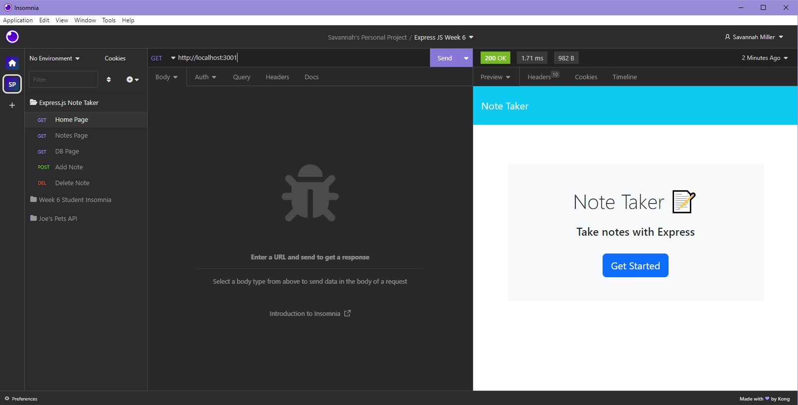

# Express.js Note Taker

## Description

Note Taker is a server run note taking application built with Express.js. This week in the UW Coding Bootcamp, we are learning how to build our own servers and use GET, POST, PUT, and DELETE methods to manipulate data and display to the front-end. Understanding how back-end and front-end code communicates with each other is a crucial concept to anyone seeking to be a full-stack developer. Building this application has helped me to understand this relationship and further my knowledge about how servers are built and maintained to handle incoming and outgoing requests.

## Installation

No installation is necessary. Please view my live, deployed application on Heroku:

## Usage

Note Taker can be used to organize thoughts and to-do's! Each note consists of a title and content. When your are done writing your note, click the "save" icon to save your note. It will appear in the left hand side column. If you'd like to view a note, simply click on it. To add another note, click the "plus" icon in the right hand corner. You can also delete a note by clicking the trash can icon on the note you are wanting to remove. Aside from this application's intended functionality, students and new developers may find it helpful to view the code and file structure to see how this project flows together. The front-end code was provided to us, while the back-end code was written from scratch. Code has been commented to describe functionality.

## Credits

The uuid package was used to generate unique id's for the notes. You can view documentation, including installation instructions, here: https://www.npmjs.com/package/uuid.

More information can be found about Express.js by viewing their guide, available here: https://expressjs.com/en/guide/routing.html.

Insomnia, an API development platform, was used for testing and validating requests as seen in the above screenshot. Get started here: https://insomnia.rest/.

## License

MIT License Copyright (c) 2023 VisualViolet
